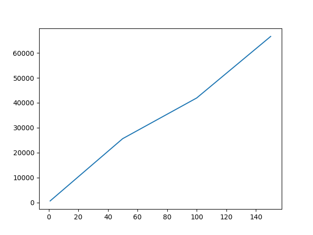

# Parameter Evaluation of Etherium
 

##	Parameters Evaluated :
	<ol>
		<li>Transaction Latency </li>
		<li>Transaction Throughput</li>
		<li>Read Latency </li> 
		<li>Read Throughput</li>
	</ol>	

 

## Transaction Latency ### addTreatment()

Parameters evaluated

1.1 Read latency
It is defined as: Time when the response received – Submit time

2.2 Read Throughput
It is defined as: Total read operations / Total time in seconds
reads per second (RPS) 

2.3 Transaction Latency
It is defined as: Transaction Latency = (Confirmation time @ network_threshold) – submit time

2.4 Transaction Throughput
It is defined as: Transaction Throughput = Total committed transactions / total
time in seconds

ALgo & ScreenShot for each parameter
	2.1 Steps for Evaluating Transaction Acceptance Latency:

1. User Operation: A set of N (1, 50, 100, 200, 400, 600) signed transactions, i.e. TX = {
TX1, TX2, TX3,...,TXN }

2. User Operation: The user node sends the created transactions to an Ethereum based GANACHE blockchain and captures the current time point t.

3 Blockchain’s Internal Process: The blockchains’ P2P network distributes the transactions to miners. The mining process (PoW consensus algorithms) will confirm the valid transactions and broadcast them to all the nodes in Ethereum.

4 User Operation: The user node will continuously query the confirmation of each transaction through web3.eth.wait_for_transaction_receipt() functionality of the w3 module. 

5 User Operation: When a transaction TXn ∈ TX is confirmed, the user node captures
the current time T, then calculates and records the transaction time of TXn , Δtn = Tn - tn.

6 User Operation: If no transactions are confirmed, GOTO Step 4

Screenshot Code

Graphs_individial

